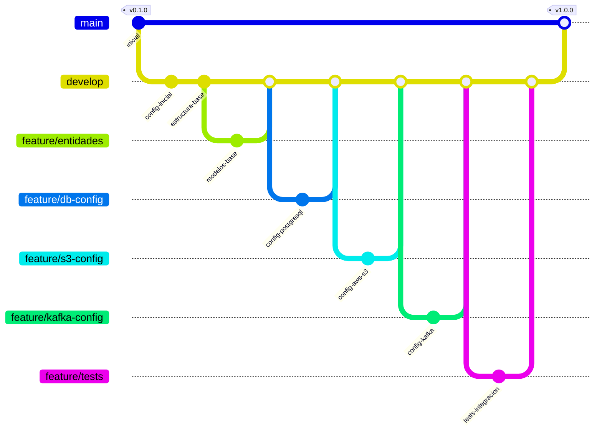

# Catalog Service - Java Spring Boot

Este proyecto es una migración del [servicio de catálogo original en Node.js](https://github.com/dockersamples/catalog-service-node) a Java Spring Boot.

## Diagrama de Git

## Estructura del Proyecto

El proyecto utiliza las siguientes tecnologías:

- Java 17
- Spring Boot 3.2.3
- PostgreSQL para almacenamiento de datos
- AWS S3 para almacenamiento de imágenes
- Apache Kafka para mensajería
- TestContainers para pruebas de integración

## Servicios Incluidos

- Base de datos PostgreSQL
- Almacenamiento S3 (LocalStack en desarrollo)
- Kafka para mensajería de eventos
- WireMock para simular el servicio de inventario

## Configuración del Entorno de Desarrollo

### Requisitos Previos

- Java 17 o superior
- Maven
- Docker y Docker Compose
- IDE (recomendado: IntelliJ IDEA o Eclipse)

### Pasos para Ejecutar

1. Clonar el repositorio
2. Iniciar los servicios con Docker Compose
3. Ejecutar la aplicación Spring Boot

## Pruebas

El proyecto incluye:
- Pruebas unitarias
- Pruebas de integración con TestContainers
- Cobertura de código

## Estado de la Migración

- [ ] Configuración inicial del proyecto
- [ ] Implementación de modelos y entidades
- [ ] Configuración de PostgreSQL
- [ ] Integración con S3
- [ ] Configuración de Kafka
- [ ] Implementación de pruebas
- [ ] Documentación completa